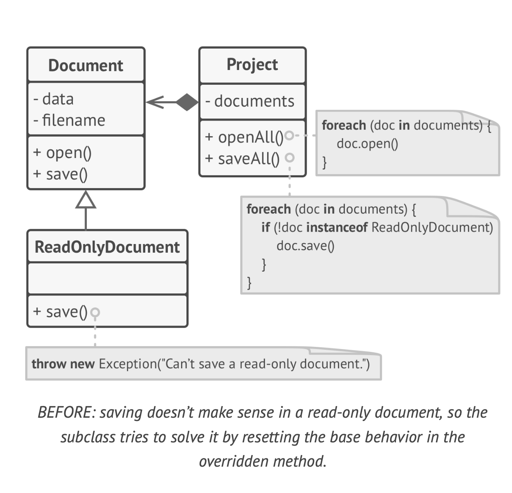
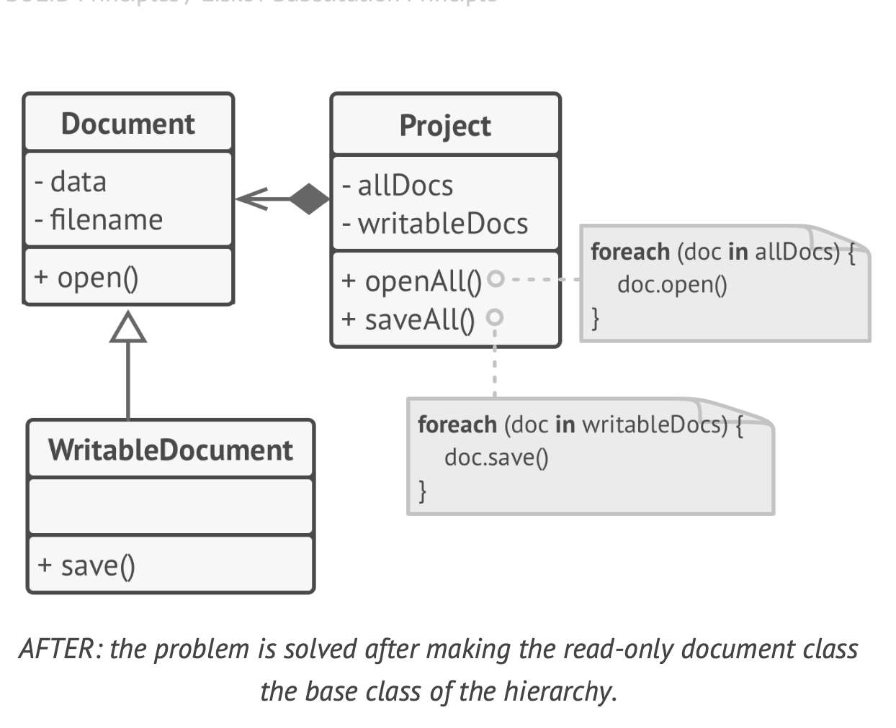

# LiskovSubstitutionPrinciple

 `When extending a class, remember that you should be
 able to pass objects of the subclass in place of objects of
 the parent class without breaking the client code`

 This means that the subclass should remain compatible with
 the behavior of the superclass. When overriding a method,
 extend the base behavior rather than replacing it with some
 thing else entirely.
  * `Parameter types in a method of a subclass should match or be
 more abstract than parameter types in the method of the super
class.` 

 Let's imagine We have a class with a method that’s supposed to feed
 cats:
 feed(Cat c) . Client code always passes cat objects
 into this method.
 ◦ Good: Say you created a subclass that overrode the method
 so that it can feed any animal (a superclass of cats):
 feed(Animal c) . Now if you pass an object of this subclass
 instead of an object of the superclass to the client code,
 everything would still work fine. The method can feed all
 animals, so it can still feed any cat passed by the client.
 ◦ Bad: You created another subclass and restricted the feed
ing method to only accept Bengal cats (a subclass of cats):
 feed(BengalCat c) . What will happen to the client code if
 you link it with an object like this instead of with the origi
nal class? Since the method can only feed a specific breed of
 cats, it won’t serve generic cats passed by the client, break
ing all related functionality.

* ` Thereturn type in a method of a subclass should match or be
 a subtype of the return type in the method of the superclass.`

 Let's we have a class with a method
 client code expects to receive any cat as a result of execut
ing this method.
 ◦ Good: A subclass overrides the method as follows:
 buyCat(): BengalCat . The client gets a Bengal cat, which
 is still a cat, so everything is okay.
 ◦ Bad: A subclass overrides the method as follows:
 buyCat(): Animal . Now the client code breaks since it
 receives an unknown generic animal (an alligator? a bear?)
 that doesn’t fit a structure designed for a cat.

 * `Amethod in a subclass shouldn’t throw types of exceptions
 which the base method isn’t expected to throw.`

In most modern programming languages, especially sta
tically typed ones (Java, C#, and others), these rules are
built into the language. You won’t be able to compile a
program that violates these rules.

* `Amethod in a subclass shouldn’t throw types of exceptions
  which the base method isn’t expected to throw. `

* `A subclass shouldn't strengthen pre-conditions.`

* `A subclass shouldn’t weaken post-conditions. `

* ` Invariants of a superclass must be preserved. `
* ` A subclass shouldn’t change values of private fields of the
 superclass`

# Example
 Let’s look at an example of a hierarchy of document classes
 that violates the substitution principle:

  

   The `save` method in the ReadOnlyDocuments subclass throws an exception if someone tries to call it. The base method doesn’t have this restriction. This means that the client code
 will break if we don’t check the document type before sav
ing it.
 The resulting code also violates the open/closed principle,
 since the client code becomes dependent on concrete class
es of documents. If you introduce a new document subclass,
 you’ll need to change the client code to support it.

 
You can solve the problem by redesigning the class hierar
chy: a subclass should extend the behavior of a superclass,
 therefore the read-only document becomes the base class of
 the hierarchy. The writable document is now a subclass which
 extends the base class and adds the saving behavior.

